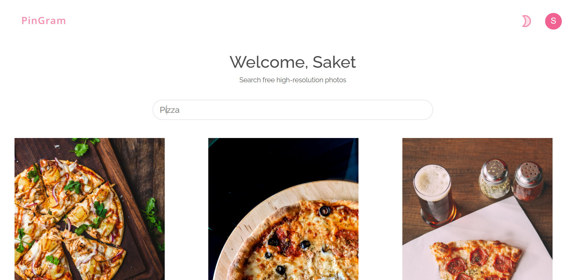
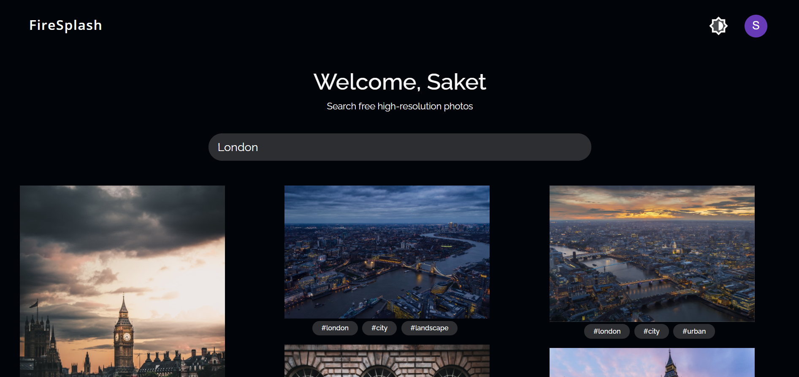

# FireSplash

#### Instagram like gallery app made with React.js using Unsplash's API. I have used tailwind.css for styling and firebase for user-authentication.

#### Screenshots

#### How to run this app:
1. clone this repository
2. create a new firebase app and configure firbase-auth. Copy your app credentials into a .env file at the root directory
3. Create an unsplash developer account and make sure your api config is secure by saving it to a .env file
4. Open a new terminal in the project directory and run the following:
    - `npm install`
    - and then, `npm start`
5. Your app should now be up and running on localhost:3000

